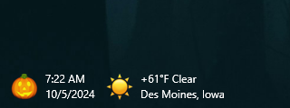

# MyRainmeterSkins

- **SimpleClock**: A minimal digital clock that shows the time and date, with emojis representing each month.
- **SimpleWeather**: Displays the current weather for a static location, along with a static sun emoji.
- **SimpleClockAndWeather**: Combines time, date, location, and weather in a single line of text.
